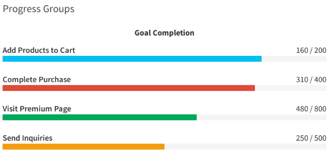

Lately, I have been working on developing a friendly shiny app around a mathematical model to enable non-modellers to get to grips with the model, play around and perhaps learn something too. This has really been as much about teaching myself Shiny as it has been about enabling others to interact with models.

[Shiny](http://shiny.rstudio.com/), is great package being developed by a handful of developers at RStudio, and it enables anyone to wrap their R code in an HTML front-end that will run on any computer with [R](https://www.r-project.org/) installed, and perhaps most importantly, run on _any_ computer if deployed to a Linux server running [ShinyServer](https://www.rstudio.com/products/shiny/shiny-server2/).

One of the things I have been trying to do with my Shiny app (which has yet to reveal itself), is to include progress bars to enable the user to visualise the progress of some background process. There is a great progress bar function in the [Shiny](http://shiny.rstudio.com/) package called [withProgress](http://shiny.rstudio.com/articles/progress.html). This allows the user to relatively pull together a progress bar that spans the width of the screen and can include a little message on the top right.

```r
server <- function(input, output) {
    output$myplot <- renderPlot({

        # The detail to be captured by the progress bar should be contained within this function and its braces
        withProgress(message = 'Creating plot', value = 0, {

            # Create an empty data.frame
            dat <- data.frame(x = numeric(0), y = numeric(0))

            for (i in 1:10) {
                # Add to it
                dat <- rbind(dat, data.frame(x = rnorm(1), y = rnorm(1)))

                # Incremental Progress Bar (add some more info if neccessary)
                incProgress(1/n, detail = paste0(i/n, "%"))

                # Pause
                Sys.sleep(0.1)
            }
        })

        plot(dat$x, dat$y)
    })
}

ui <- shinyUI(basicPage(plotOutput('myplot', width = "300px", height = "300px")))

shinyApp(ui = ui, server = server)
```

This is all great, but in my app, on one particular page, there is a whole model calibration thing going on, and I wanted to be able to relay info on which function was running, whether any errors were encountered, when plots were being generated etc. Having been inspired by the [shinydashboard](https://rstudio.github.io/shinydashboard/) package which is based on the incredible [AdminLTE](https://almsaeedstudio.com/preview) bootstrap template, I happened across this great script for creating group progress bars on [GitHub](https://github.com/rstudio/shinydashboard/issues/119).

<center></center>

I decided to try and implement this myself, and figured out, with thanks to [John Malc](https://github.com/dmpe), that I needed to use [renderUI](http://shiny.rstudio.com/reference/shiny/latest/renderUI.html) to animate the bars.

This is my __server.R__

```r
library(shiny)
library(shinydashboard)

prgoressBar <- function(value = 0, label = FALSE, color = "aqua", size = NULL,
                        striped = FALSE, active = FALSE, vertical = FALSE) {
    stopifnot(is.numeric(value))
    if (value < 0 || value > 100)
        stop("'value' should be in the range from 0 to 100.", call. = FALSE)
    if (!(color %in% shinydashboard:::validColors || color %in% shinydashboard:::validStatuses))
        stop("'color' should be a valid status or color.", call. = FALSE)
    if (!is.null(size))
        size <- match.arg(size, c("sm", "xs", "xxs"))
    text_value <- paste0(value, "%")
    if (vertical)
        style <- htmltools::css(height = text_value, `min-height` = "2em")
    else
        style <- htmltools::css(width = text_value, `min-width` = "2em")
    tags$div(
        class = "progress",
        class = if (!is.null(size)) paste0("progress-", size),
        class = if (vertical) "vertical",
        class = if (active) "active",
        tags$div(
            class = "progress-bar",
            class = paste0("progress-bar-", color),
            class = if (striped) "progress-bar-striped",
            style = style,
            role = "progressbar",
            `aria-valuenow` = value,
            `aria-valuemin` = 0,
            `aria-valuemax` = 100,
            tags$span(class = if (!label) "sr-only", text_value)
        )
    )
}

progressGroup <- function(text, value, min = 0, max = value, color = "aqua") {
    stopifnot(is.character(text))
    stopifnot(is.numeric(value))
    if (value < min || value > max)
        stop(sprintf("'value' should be in the range from %d to %d.", min, max), call. = FALSE)
    tags$div(
        class = "progress-group",
        tags$span(class = "progress-text", text),
        tags$span(class = "progress-number", sprintf("%d / %d", value, max)),
        prgoressBar(round(value / max * 100), color = color, size = "sm")
    )
}


shinyServer(function(input,output){

    # Create some REACTIVE VALUES
    progressValue <- reactiveValues()
    progressValue$one <- 0
    progressValue$two <- 0
    progressValue$three <- 0
    progressValue$four <- 0

    # Render UI output
    output$progressOne <- renderUI({
        progressGroup(text = "Sample Parameter Space",    value = progressValue$one,   min = 0, max = 100, color = "aqua")
    })

    output$progressTwo <- renderUI({
        progressGroup(text = "Evaluate Simulation Error", value = progressValue$two,   min = 0, max = 100, color = "red")
    })

    output$progressThree <- renderUI({
        progressGroup(text = "Resample top 10%",          value = progressValue$three, min = 0, max = 100, color = "green")
    })

    output$progressFour <- renderUI({
        progressGroup(text = "Compile Output",            value = progressValue$four,  min = 0, max = 100, color = "yellow")
    })

    # Then on action button, allow bar to move up.
    observeEvent(input$goButton, {

        for(i in 1:100) {
            progressValue$one <- i
            progressValue$two <- i
            progressValue$three <- i
            progressValue$four <- i
            Sys.sleep(0.1)
        }

    })

})
```

This is my __ui.R__

```r
library(shiny)
library(shinydashboard)

shinyUI(
    dashboardPage(
      dashboardHeader(title = "Playground App"),
      dashboardSidebar(
            sidebarMenu(
                id = "sideBar",
                menuItem("Progress Bar", tabName = "progress", icon = icon("home", class = "fa-lg fa-fw", lib = "font-awesome"))
            )
        ),
        dashboardBody(
            tabItems(
                tabItem(tabName = "progress",
                    column(width = 8,
                        box(width = NULL,
                            status = "primary",
                            solidHeader = TRUE,
                            collapsible = TRUE,
                            collapsed = FALSE,
                            title = "Calibration",
                            helpText("Progress Bar Demo."),
                            p(strong("Goal Completion"), class = "text-center"),
                            uiOutput(outputId = "progressOne"),
                            uiOutput(outputId = "progressTwo"),
                            uiOutput(outputId = "progressThree"),
                            uiOutput(outputId = "progressFour")
                        )
                    ),
                    column(width = 4,
                        box(width = NULL,
                            status = "warning",
                            solidHeader = TRUE,
                            title = "Button",
                            actionButton("goButton", "HIT ME")
                        )
                    )
                )
            )
        )
    )
)
```

The above works, if we just use a simple [actionButton](http://shiny.rstudio.com/reference/shiny/latest/actionButton.html), but if I include a loop, then the the progress bars just get _grayed out_ almost as if the render function can't keep up with the for loop. Luckily, once the loop finishes then the bars update, but they are not of much use beforehand.

### The Solution

I decided, against my better judgement to move away from the group progress bar and rethink my use of [withProgress](http://shiny.rstudio.com/articles/progress.html). In fact, I could make do with this function if I could customise it, so I took the plunge and decided to get my hands dirty with the shiny CSS. After spending some time inspecting the soup of files that are generated and run when a shiny app is active, I located the attributes reponsible for the Shiny Progress Bar. Below are the changes I have made to improve the appearance of the bars.

```css
/* Make sure the filename doesn't extend past the bounds of the container */
.shiny-input-container input[type=file] {
    overflow: hidden;
    max-width: 100%;
}

.shiny-progress-container {
    position: fixed;
    top: 0px;
    width: 100%;
    z-index: 2000;
}

.shiny-progress .progress {
    position: absolute;
    width: 100%;
    top: 0px;
    /* The default height is only 1px which is find to be TINY */
    height: 8px;
    margin: 0px;
}

.shiny-progress .bar {
    background-color: #FF0000;
    .opacity = 0.8;
    transition-duration: 250ms;
}

.shiny-progress .progress-text {
    position: absolute;
    right: 30px;
    height: 30px;
    width: 490px;
    background-color: #D9534F;
    padding-top: 2px;
    padding-right: 3px;
    padding-bottom: 2px;
    padding-left: 3px;
    opacity: 0.95;
    /* I also wanted to round off the corners of the text box */
    border-radius: 10px;
    -webkit-border-radius: 10px;
    -moz-border-radius: 10px;
}

.progress-text {
    /* Copy the below to vertically center the progress bar text box in the shiny dashboard header */
    /* !important is crucial here otherwise it gets overridden by the dreaded element.style */
    top: 15px !important;
    color: #FFFFFF !important;
    text-align: center;
}

/* Bold Initial part of message */
.shiny-progress .progress-text .progress-message {
    padding-top: 0px;
    padding-right: 3px;
    padding-bottom: 3px;
    padding-left: 10px;
    font-weight: bold;
    font-size: 18px;
}

/* Message detail */
.shiny-progress .progress-text .progress-detail {
    padding-top: 0px;
    padding-right: 3px;
    padding-bottom: 3px;
    padding-left: 3px;
    font-size: 17px;
}
```

To include this CSS in your Shiny app, you can either write it [in-line](http://shiny.rstudio.com/articles/css.html), but thats a bit naff, so dump it in a .css file and in your __ui.R__

```r
dashboardPage(
    dashboardBody(
        # Write the path to your .css file
        includeCSS("styles.css")
        # The guts of your app
    )
)
```

All done, enjoy!

<center></center>
