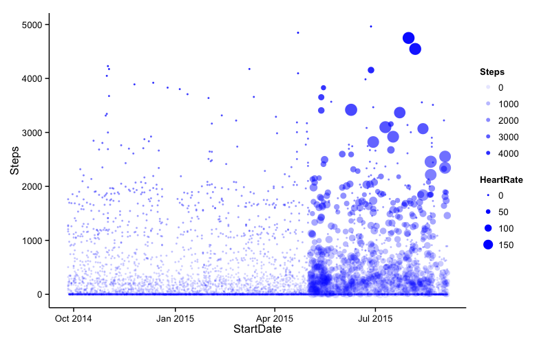
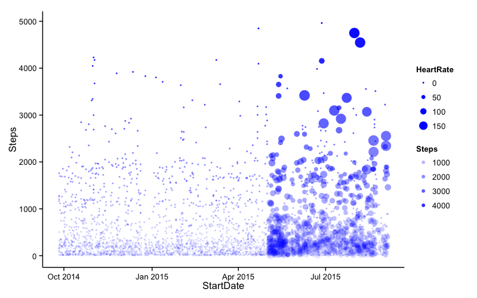
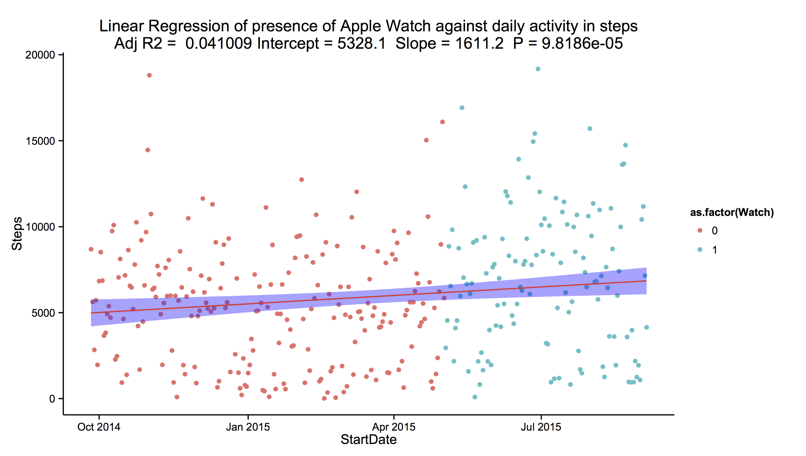
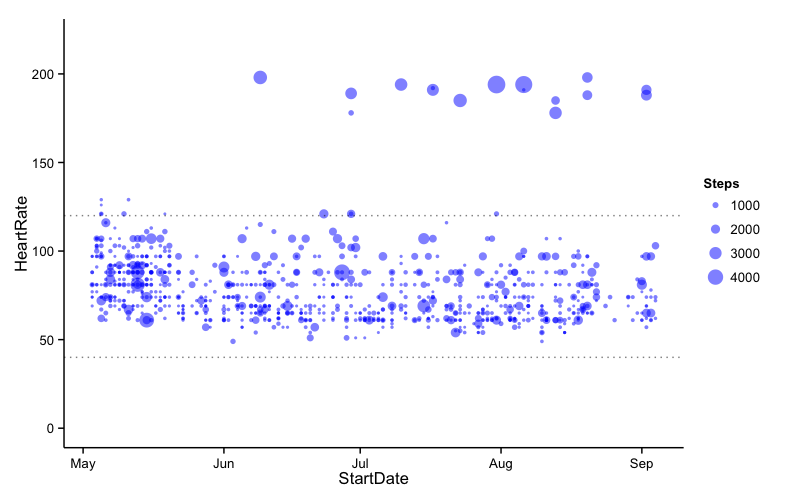

# Overview
Having owned an Apple Watch since early May, I have built up a substantial amount of data in Apple's 'HealthKit', detailing my daily steps from in excess of a year prior to owning the watch to at least six months after. Therefore, a simple analysis of whether the watch has improved my fitness should be possible. Additionally, I can pull out heart-rate data, stair-flight data, exercise data and map a whole bunch of other interesting stuff.

All data is from my iPhone 6+ and my Apple Watch, all analysis was conducted in R and all figures were produced with ggplot2.

# Setup

The first thing to do is it to export the relevant data from 'HealthKit' as a csv file. We do this using the [QS Access](https://itunes.apple.com/gb/app/qs-access/id920297614?mt=8) iOS app from the App Store. The app allows you to define the columns by selecting the relevant data to export (e.g. Steps, Heart Rate etc.) and then define rows as being hourly or daily. The simplest way to transfer the csv from iPhone to Mac is via email. Now we can jump right into R and start cleaning the data.

## Data Cleaning

```R
# Set the working directory to the folder containing the exported .csv
setwd("~/")

# Load 'dplyr' and 'ggplot2' for data analysis and plotting
require(dplyr)
require(ggplot2)

# Load in the exported .csv file
# The data I am importing was exported from my iPhone on 4th September, 2015
MyCsvData <- read.csv("./HealthData/HealthData_04-09-15.csv")
MyCsvDataHourly <- read.csv("./HealthData/HealthDataHourly_04-09-15.csv")
```

Probably the most time consuming aspect of any data analysis is cleaning and correctly formatting the data. Here, we must ensure that R can understand the exported date format correctly. To rectify this we define a function `FormatData()` which takes the entire dataframe as an arguement and returns a dataframe containing the correct date format.

```R
FormatData <- function(Data) {

    # Define the 'Start' and 'End' columns.
    StartDate <- as.Date(Data$Start,format="%d-%b-%Y %H:%M")
    EndDate <- as.Date(Data$Finish,format="%d-%b-%Y %H:%M")

    # Turn into a smart dataframe.
    # if you print a tbl_df to screen only the first 10 rows are shown.
    MyData <- tbl_df(Data)

    # Cleanup data.names
    names(MyData)[1] <- "StartTime"
    names(MyData)[2] <- "EndTime"
    names(MyData)[3] <- "Calories" # kcal
    names(MyData)[4] <- "Distance" # In miles
    names(MyData)[5] <- "Flights" # count
    names(MyData)[6] <- "HeartRate" # bpm
    names(MyData)[7] <- "Steps" # count

    # Formatting date. #
    ####################
    # Code    Value
    # %d  Day of the month (decimal number)
    # %m  Month (decimal number)
    # %b  Month (abbreviated)
    # %B  Month (full name)
    # %y  Year (2 digit)
    # %Y  Year (4 digit)

    # Deploy and mutate whole dataFrame
    FormatDate <- function(x) {
        format(strptime(TestDate,"%d-%b-%Y %H:%M"),"%d-%m-%Y")
    }

    FormatTime <- function(x) {
        format(strptime(x,"%d-%b-%Y %H:%M"),"%H:%M")
    }

    # StartDate <- apply(MyData[1],2,FormatDate)
    StartTime <- apply(MyData[1],2,FormatTime)
    StartDateTime <- MyData[1]

    # EndDate <- apply(MyData[2],2,FormatDate)
    EndTime <- apply(MyData[2],2,FormatTime)
    EndDateTime <- MyData[2]

    # Pull together a new dataframe
    MyFormattedData <- tbl_df(data.frame(
        StartDate,
        StartTime,
        EndDate,
        EndTime,
        StartDateTime,
        EndDateTime,
        MyData$Calories,
        MyData$Distance,
        MyData$Flights,
        MyData$HeartRate,
        MyData$Steps))

    # Neaten up names
    names(MyFormattedData)[1] <- "StartDate"
    names(MyFormattedData)[2] <- "StartTime"
    names(MyFormattedData)[3] <- "EndDate"
    names(MyFormattedData)[4] <- "EndTime"
    names(MyFormattedData)[5] <- "StartDateTime"
    names(MyFormattedData)[6] <- "EndDateTime"
    names(MyFormattedData)[7] <- "Calories" # kcal
    names(MyFormattedData)[8] <- "Distance" # In miles
    names(MyFormattedData)[9] <- "Flights" # count
    names(MyFormattedData)[10] <- "HeartRate" # bpm
    names(MyFormattedData)[11] <- "Steps" # count

    return(MyFormattedData)
}

# Applying this to our dataset
DailyData <- FormatData(MyCsvData)
HourlyData <- FormatData(MyCsvDataHourly)
```

# Analysis
We first produce a plot of steps against time, with some additional stratification in the form of heart rate using the following script and our hourly dataset (for greater resolution).

```R
ggplot(HourlyData, aes(x = StartDate, y = Steps)) +
geom_point(aes(size = HeartRate, alpha = Steps), col = "Blue") +
theme_classic()
```



The first thing we see is a considerable amount of 0-step hours in the data. This is because I sleep for about 6 hours per night, or perhaps may have not worn my watch that day. In any case, it is advisable to remove these zero values. However, it is nice to see the colour that including my heart rate from May 2015 adds to the plot. The large points in the upper right of the figure are likely from periods of exercise (as will be discussed later).

```R
# Cutting the crap
NonZero <- filter(HourlyData,Steps != 0)

# Re-do the previous plot
ggplot(NonZero, aes(x = StartDate, y = Steps)) +
geom_point(aes(size = HeartRate, alpha = Steps), col = "Blue") +
theme_classic()
```



That's better! Right, now some for simple regression analysis.

## Simple Regression
> ___"Irrespective of workouts, has the Apple Watch increased the number of steps I walk each day?"___

To answer this question, we are going to build a simple regression model; but first, we must add a new column informing the data of whether I owned the watch on a particular day.

```R
# Cut the zero-step data from the dataset (as before)
theData <- filter(DailyData,Steps != 0)

# 3rd of May 2015 was the day I bought my Apple Watch
# Add a column with '1' if date >= 3rd of May 2015, else '0'
theData <- mutate(theData, Watch = ifelse(StartDate >= "2015-05-03",1,0))
```

If we a create a simple linear model model with 'Steps' as the dependent variable (the outcome whose variation is being studied), and 'Watch' as the independent variable (input or potential reason for variation).

```R
fit1 <- lm(Steps ~ Watch, data = theData)
summary(fit1)

# Call:
# lm(formula = Steps ~ Watch, data = theData)

# Residuals:
#     Min      1Q  Median      3Q     Max
# -6849.3 -2993.1   -60.1  2352.2 13485.9

# Coefficients:
#             Estimate Std. Error t value Pr(>|t|)
# (Intercept)   5328.1      247.5  21.531  < 2e-16 ***
# Watch         1611.2      408.7   3.942 9.82e-05 ***
# ---
# Signif. codes:  0 '***' 0.001 '**' 0.01 '*' 0.05 '.' 0.1 ' ' 1

# Residual standard error: 3637 on 339 degrees of freedom
# Multiple R-squared:  0.04383,   Adjusted R-squared:  0.04101
# F-statistic: 15.54 on 1 and 339 DF,  p-value: 9.819e-05
```

From this simple model, we see that prior to buying the watch, I walked an average of 5,328 steps per day (the intercept of the model); yes, not very many steps. However, after buying the watch, I walked an average of 1,611 _more_ steps per day -- great!

Although the R-squared value, the coefficient of determination, (or in english, how close the data fit to the model), is only 4%. This means that the presence of the watch only explains 4% of the variation in my daily steps. This is because we have yet to control for other factors, such as the day of the week, or whether I was exercising at the time. The model is saying that the presence of the watch in my life is not the sole reason for my movement. However, the value of R-squared should always be taken with a pinch of salt. There is inherent randomness in my daily steps and it would be near impossible to control for all additional covariates. As the F-statistic shows a statistically significant relationship (p < 0.05), we accept that the watch has improved my fitness level. Checks of the residuals increase our confidence in the findings.

```R
ggplot(theData, aes(x = StartDate, y = Steps)) +
geom_point(aes(col = as.factor(Watch)), alpha = 1) +
theme_classic() +
geom_smooth(method = "lm", col = "red", fill = "blue") +
labs(title = paste("Linear Regression of presence of Apple Watch against daily activity in steps\nAdj R2 = ",signif(summary(fit1)$adj.r.squared, 5),
    "Intercept =",signif(fit1$coef[[1]],5 ),
    " Slope =",signif(fit1$coef[[2]], 5),
    " P =",signif(summary(fit1)$coef[2,4], 5))
)
```



# An Aside
As a quick end to this post, I wanted to see what my hourly heart rate looked like over time. Additionally, I was keen to see whether my heart rate ever drops below 40bpm (bradycardia) or above 120bpm (tachycardia). As we see from the figure below, my heart rate doesn't drop below 40bpm and only rarely steps about 120bpm. It should be noted that the outliers ~200bpm are from periods of exercise. As I collect more data, and exercise more, I would hope to look for a downward trend in my heart rate as my maximum heart rate when exercising declines, indicating increased fitness, one would hope.


